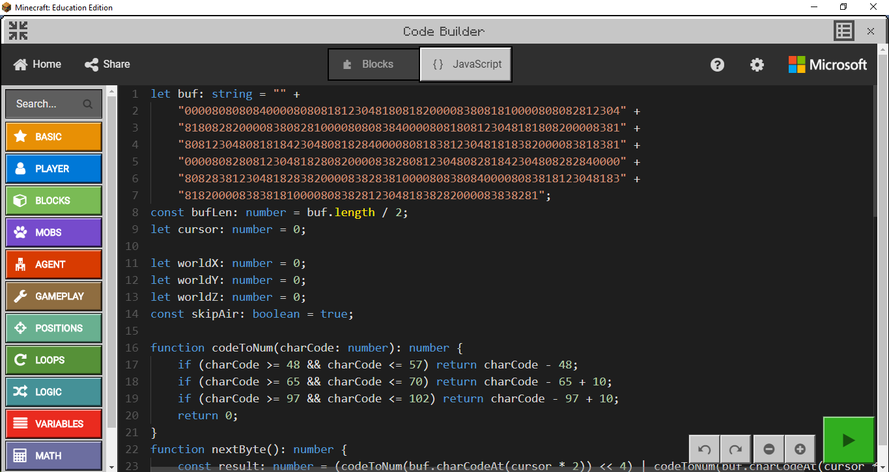
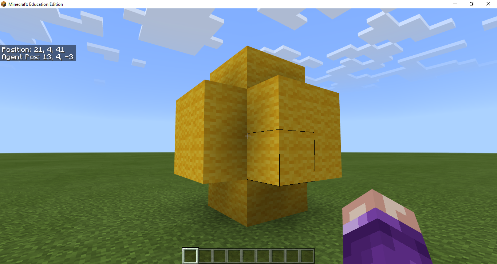

This tool allows converting Minecraft Java schematic files into MakeCode script that can rebuild the schematic in the Minecraft: Education Edition world.

To use the converter just drag and drop the schematic file on to the schematicToMakeCode.exe file that you will find in releases.

To use the script you need to 
1) Paste it inside the JavaScript view of MakeCode in Minecraft: Education Edition.

2) Close MakeCode window.
3) Press "Enter" and then type "jump x y z" where x y z are coordinates of the player. 
For example: 

4) Wait for schematic to be rebuilded in your world. 


Here is an example of a generated script:
```
let buf : string = ""+
"0000808080840000808081812304818081820000838081810000808082812304"+
"8180828200008380828100008080838400008081808123048181808200008381"+
"8081230480818184230480818284000080818381230481818382000083818381"+
"0000808280812304818280820000838280812304808281842304808282840000"+
"8082838123048182838200008382838100008083808400008083818123048183"+
"8182000083838181000080838281230481838282000083838281";
const bufLen : number = buf.length / 2;
let cursor : number = 0;

let worldX : number = 0;
let worldY : number = 0;
let worldZ : number = 0;
const skipAir: boolean = true;

function codeToNum(charCode : number) : number {
    if (charCode >= 48 && charCode <= 57) return charCode - 48;
    if (charCode >= 65 && charCode <= 70) return charCode - 65 + 10;
    if (charCode >= 97 && charCode <= 102) return charCode - 97 + 10;
    return 0;
}
function nextByte() : number {
    const result : number = (codeToNum(buf.charCodeAt(cursor*2)) << 4) | codeToNum(buf.charCodeAt(cursor*2+1));
    ++cursor;
    return result;
}

function nextVarNum() : number {
    let position : number = 0;
    let value : number = 0;
    while(true) {
        const byte : number = nextByte();
        value |= (byte & 0b1111111) << position;
        position += 7;
        if (byte & 0b10000000) return value;
    }
}

function runNextCommand() : void {
    const blockId   : number = nextByte();
    const blockData : number = nextByte();
    const runStartX : number = worldX + nextVarNum();
    const runStartY : number = worldY + nextVarNum();
    const runStartZ : number = worldZ + nextVarNum();
    const runLength : number = nextVarNum();

    const fullBlockId : number = (blockData << 16) | blockId;

    if (blockId == 0 && skipAir) return;

    if (runLength)
        shapes.line(fullBlockId,
            positions.createWorld(runStartX, runStartY, runStartZ),
            positions.createWorld(runStartX+runLength-1, runStartY, runStartZ));
    else
        blocks.place(fullBlockId,
            positions.createWorld(runStartX, runStartY, runStartZ));
}

player.onChat("jump", function (x : number, y:number, z:number) {
    worldX = x;
    worldY = y;
    worldZ = z;
    while(cursor < bufLen) runNextCommand();
    player.say("Import done from yellow.0.ts");
});
```

